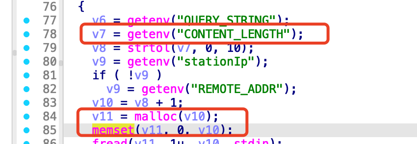
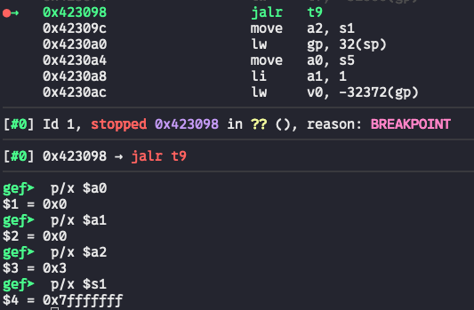
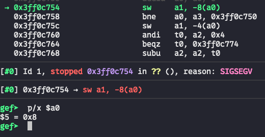

# Bug Report: NPD in D-Link DIR-823G Router
A null pointer dereference null pointer dereference overflow vulnerability has been identified in the TOTOLINK N600R router firmware that allows remote attackers to cause denial of service.

## Vulnerability Details

### Product Information
- **Product**: TOTOLINK N600R Wireless Router
- **Affected Version**: V4.3.0cu.7866_B20220506
- **Download Source**: https://totolink.tw/support_view/N600R
- **Vulnerability Type**: Null pointer dereference

## Description:
The vulnerable code path within the `main` function of cstecgi.cgi extracts the `CONTENT_LENGTH` environment variable by `getenv` and passes it as the size parameter of `malloc`. However, when the `CONTENT_LENGTH` is set as a large size, the `malloc` would return null. The null pointer is passed into `memset` without a null check, leading to a null pointer dereference resulting in a DoS attack.


## poc

We set a breakpoint before the function call `memset` at line 84. By dumping the registers, we can see that `v11` is null and `v10` is a positive value. By tracing the execution, we find a null pointer dereference occurs.



## reproduce

```bash
./CONTENT_LENGTH_MAX.sh
```
```bash
gdb-multiarch ./web_cste/cgi-bin/cstecgi.cgi
```

### CONTENT_LENGTH_MAX.sh
```bash
chroot ./ ./qemu-mips-static\
        -E CONTENT_LENGTH="2147483646" \
        -g 123 -L ./lib \
        ./web_cste/cgi-bin/cstecgi.cgi < null.json
```
### null.json
```json
{
    
}
```