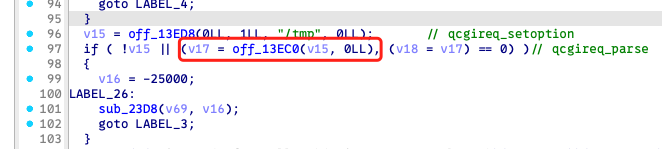
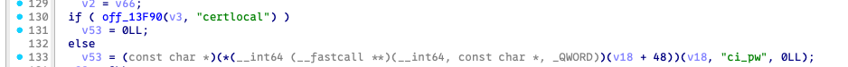
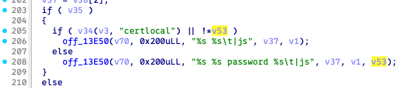
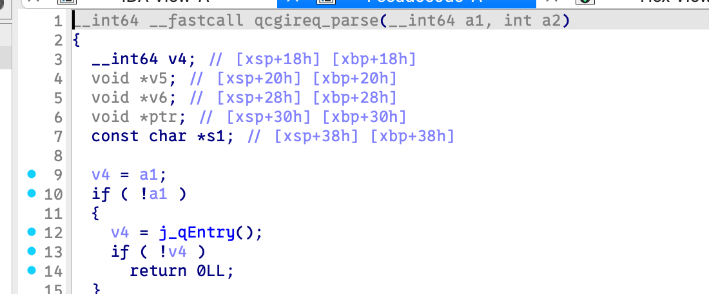
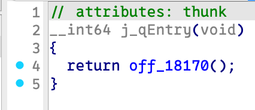
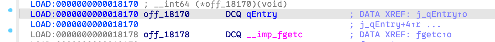
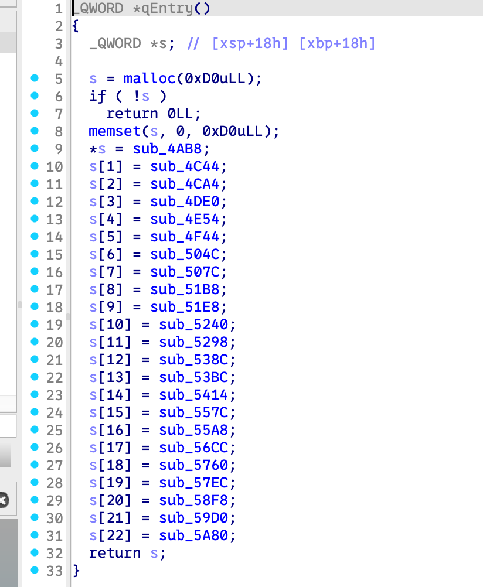
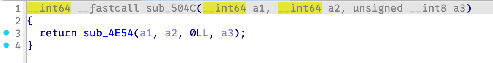
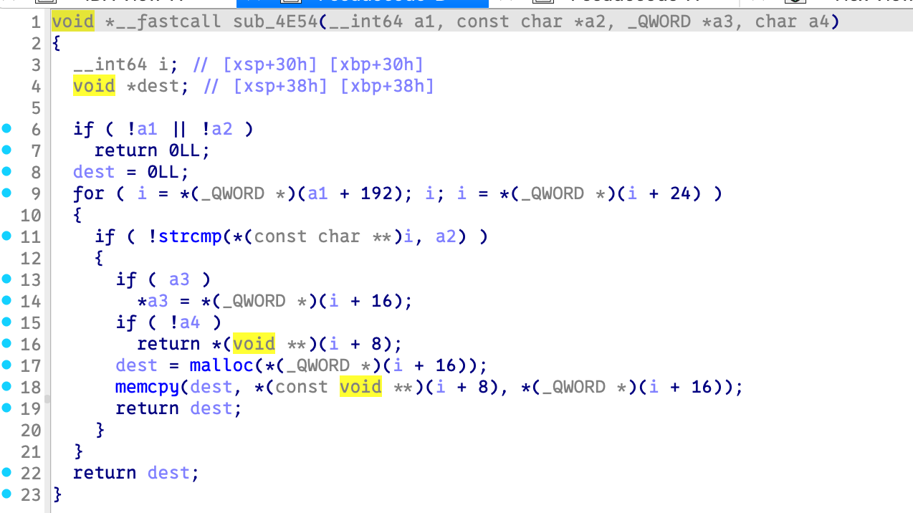

# Bug Report: NPD in Zyxel_NWA50AX_PRO
A null pointer dereference null pointer dereference overflow vulnerability has been identified in the  Zyxel_NWA50AX_PRO WIFI range extender firmware that allows remote attackers to cause denial of service through malformed HTTP requests.

## Vulnerability Details

### Product Information
- **Product**: Zyxel_NWA50AX_PRO
- **Affected Version**: 7.10(ACGE.3)C0
- **Download Source**: https://www.zyxel.com/global/en/support/download?model=nwa50ax-pro
- **Vulnerability Type**: Null pointer dereference

## Description:
A null pointer dereference vulnerability exists in the `sub_1750` function of the `file_upload-cgi` binary. When processing requests with `certlocal` type but missing the `pi_cw` parameter, the application crashes due to dereferencing an unvalidated null pointer.

**Location:** `sub_1750` function in `file_upload-cgi` binary  
**Vulnerability Type:** Null Pointer Dereference (CWE-476)  
**Affected Code Flow:**

- Line 97: `v18` assignment
- 
- Line 133: `v53` assignment
- 
- Line 205: Null pointer dereference via `!*v53`
- 
  
### Library Function Behavior

Analysis of `libqdecoder.so.12` reveals the following call chain:

**`qcgireq_parse` function**
 - Returns the result of `j_qEntry()` to `v18`
 - 
   
**`v18 + 48` resolves to `sub_504c`**
 - Acts as a wrapper for `sub_4E54`
 - **Can return NULL** when the requested parameter does not exist
 - 
 - 
 - 
 - 
 - 

**Missing Parameter Scenario**
 - When the request object `v18` does not contain the `pi_cw` parameter, `v18[6]` returns NULL
 - This NULL value is assigned to `v53` without validation

